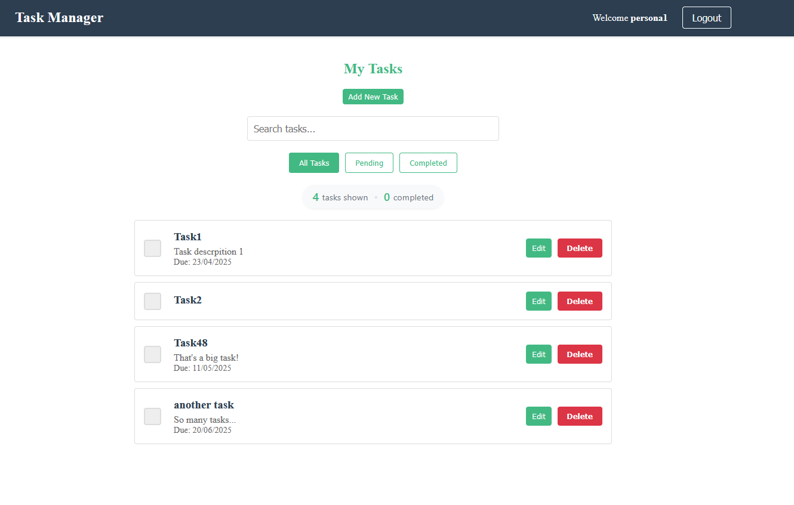

# TMApp
Task Management Application - Developed for PrediSurge technical assessment

## Description
This project implements a simple Task Management Application composed of:
- a backend REST API in Java (Spring)
- a frontend Vue.js interface

## Requirements
To build and run this project, you'll need at least:
- Java 17
- node 20.11
- npm 10.4

## Build & Run

Init the database:
```bash
$ docker-compose up -d
```

Start the webservices:
```bash
$ cd demo
$ mvn spring-boot:run
```

Start the frontend interface server:
```bash
$ cd frontend
$ npm run serve
```

Then, the project is accessible on http://localhost:5173.


